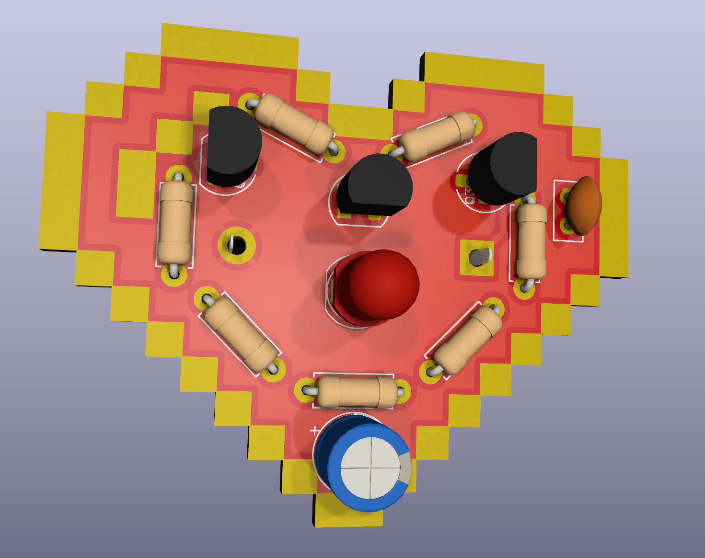
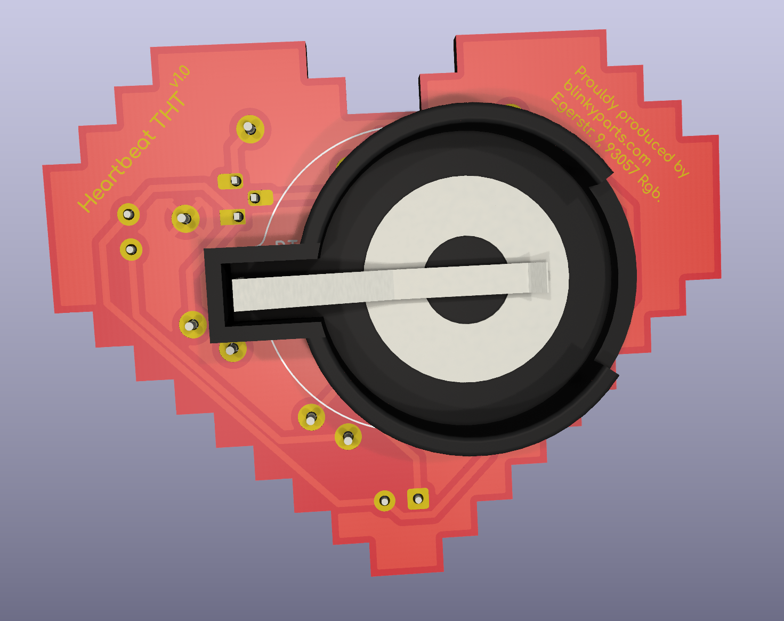

# Heartbeat THT
Eine einfache Schaltung die eine LED sehr lange zum pulsieren bringt. Mit 3V sieht es sehr witzig aus, als ob die LED aus sich heraus platzen würde.

 

## Schaltungsidee
- https://www.maltepoeggel.de/?site=dauerblitzer
- Original von: https://www.b-kainka.de/bastel59.htm

## Platinendesing
- Originaldesign von: https://thenounproject.com/icon/heart-8097843/
- Created by ColorCombo from Noun Project
  Leicht angepasst. Wir haben eine Lizenz gekauft um den Künstler zu unterstützen, das solltest du auch machen!

